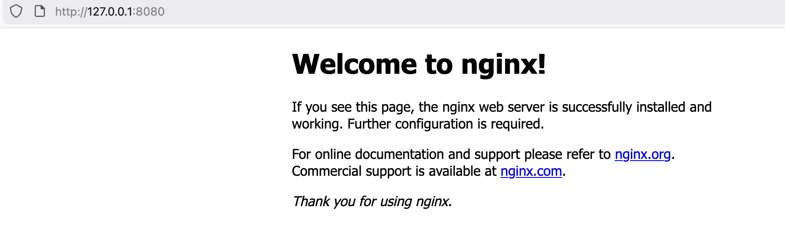

# How to 

## Helm Chart
### How to create Helm chart?

```bash 
helm create <chart-name>
```

### How to install helm chart?

```bash
helm install installation-name chartname
```

```bash 
helm install firstchart firstchart
```

```bash
NAME: firstchart
LAST DEPLOYED: Thu Jan 15 10:25:59 2026
NAMESPACE: default
STATUS: deployed
REVISION: 1
DESCRIPTION: Install complete
NOTES:
1. Get the application URL by running these commands:
  export POD_NAME=$(kubectl get pods --namespace default -l "app.kubernetes.io/name=firstchart,app.kubernetes.io/instance=firstchart" -o jsonpath="{.items[0].metadata.name}")
  export CONTAINER_PORT=$(kubectl get pod --namespace default $POD_NAME -o jsonpath="{.spec.containers[0].ports[0].containerPort}")
  echo "Visit http://127.0.0.1:8080 to use your application"
  kubectl --namespace default port-forward $POD_NAME 8080:$CONTAINER_PORT
```

By default chart will expose via `ClusterIP`. You can expose via port-forward using below command. 

### How to expose locally?

```bash 
kubectl --namespace default port-forward $POD_NAME 8080:$CONTAINER_PORT
```



## How to package chart?

```bash
helm package chartname 
helm package chartname -d /path/to/chartpackage 
```

