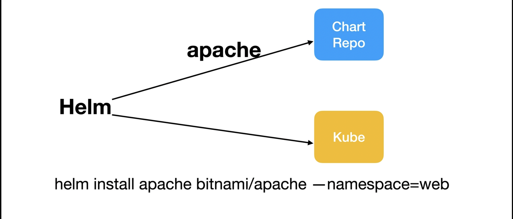
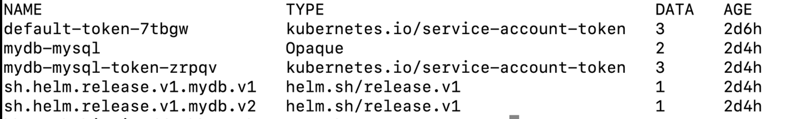
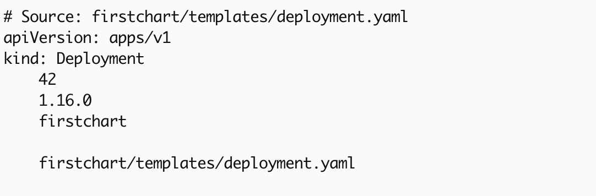
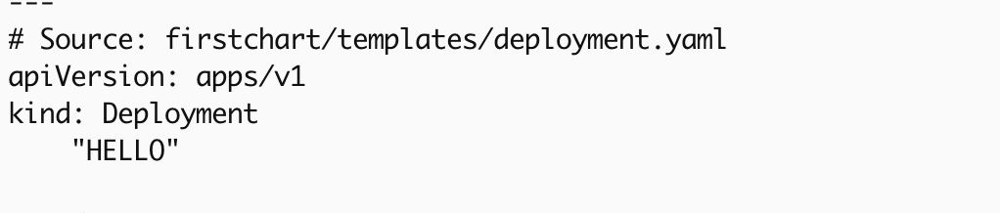
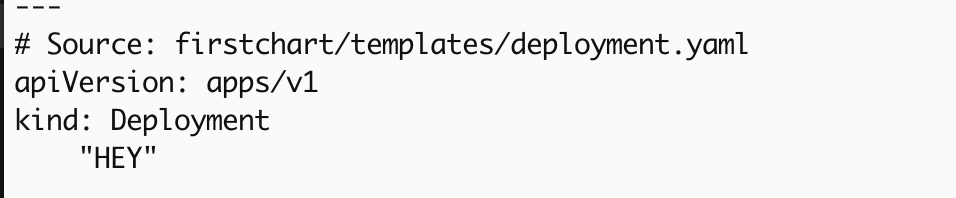
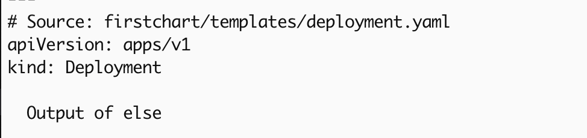

# Helm 
This file explains about helm commands and concepts. Helm uses the `Go` programming languages text template engine. 

## Helm repo 

Helm repo contains the packages which we used to deploy. 

```bash 
helm install apache bitnami/apache --namespace front-end 
helm upgrade apache bitnami/apache --namespace front-end 
helm rollback apache 1 --namespace front-end 
helm uninstall apache --namespace front-end 
```



## Advantages of using helm:
-   Helm maintains revision history
-   Dynamic configuration using values.yaml. 
-   Consistency.
-   Life cycle hooks. 
-   Charts are secured, signed and verified.  

### Helm popular repo 

```bash 
#popular repo for helm 
https://bitnami.com/stacks

# source of the charts 
https://github.com/bitnami/charts
```

## Work with repo:

```bash
#list the repo 
helm repo list 

#add the repo
helm repo add bitnami https://charts.bitnami.com/bitnami 

#search repo 
helm search repo apache 

#shows latest version
helm search repo mysql 

#see all versions
helm search repo mysql --version 

##remove repo
helm repo remove bitnami 
```

## Helm custom values 

```bash 
helm install mydb bitnami/mysql -f values.yaml 
helm upgrade mydb bitnami/mysql --reuse-values 
```

## Release records 

When we do `kubectl get secrets` command we will get secrets, this will have entire information about the installations. When we do `helm uninstall name` the secrets also will be get deleted. You can also use `helm uninstall name --keep-history` 



```bash 
#list the helm charts 
helm ls 

#get the secrets 
kubectl get secrets 
```
### How to create chart

Refer [create-chart](files/how_to.md#how-to-create-helm-chart)

### Template Actions 

One of the basic element syntax in helm is Actions. It starts with two flower brackets and end with two flower brackets. It's used to define variables, logics, hooks, invoking functions. 

```yaml 
apiVersion: apps/v1
kind: Deployment
  {{"Helm template is"  -}} , {{- "cool"}} #this trailing spaces will avoid if any unncessary spaces. 
```

```bash 
#execute below the chart after edit 
helm template firstchart
```


### Template information

`dot` represents `root` object, all the resources which use it. Other than we have sub objects. 

For the below example file you will see the snap. 

```yaml
apiVersion: apps/v1
kind: Deployment
    {{.Values.my.custom.values}}
    {{.Chart.AppVersion}}
    {{.Chart.Name}}
    {{.Release.name}}
    {{.Template.Name}}
```



### Pipelines 

This `|` symbol says or allow us to combine multiple expressions from output of left side of the expressions, commands and functions will be passed to right side of the expressions or commands. Here `default`, `upper`, `quote` are the functions in Helm. 

```yaml
#deployment.yaml 
apiVersion: apps/v1
kind: Deployment
    {{ .Values.my.custom.values | default "Hey" | upper | quote }}

#values.yaml 
my: 
  custom:
    values: "hello"
```



- If not pass the values? Below is output 

```yaml
my: 
  custom:
    values: ""
```



### Functions 

Helm uses various functions like default, upper, quote. One another function is nindent `new line indent`. So, when you mention `nindent 4` it will add the new line with 4 spaces. same like `toYaml .` will convert into the yaml format as well. 

### Conditions

```yaml 
#deployment.yaml
apiVersion: apps/v1
kind: Deployment
    {{- if .Values.my.custom.values}}
    {{"Output of if" | nindent 2}}
    {{- else}}
    {{"Output of else" | nindent 2}}
    {{- end}}

#values.yaml 
my: 
  custom:
    values: false  
```



### With condition

We use the `with` element when we need some list block here. `toYaml` will convert into objects and dot represents the values current path. 

```yaml
#values.yaml 
my: 
  custom:
    values: 
      - sample
      - test
      - demo
      - example

#deployment.yaml
apiVersion: apps/v1
kind: Deployment
  {{- with .Values.my.custom.values }}
  {{- toYaml . | nindent 4 }}
  {{- end }}
```


###  example of go programming syntax:

```bash
    {{ include "firstchart.fullname" . }}
```

### .helmignore file 

- .helmignore    *.txt  This file used to ignore the files on helm package. 

### Helm lint command 

```bash 
    helm lint <chart-name>
```

- Zero exit code says success, Non-zero exit code shows the error. 

