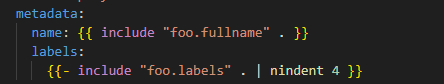

# Helm Templates 
Helm uses the `Go` programming languages text template engine. 

###  example of go programming syntax:
```bash
    {{ include "firstchart.fullname" . }}
```


- Template Actions
- Conditions 
- Loops 
- Variables 

## Template Actions 
One of the basic and most used syntax is Actions. It starts with `{{` start flower brackets and ending with `}}` flower brackets. 